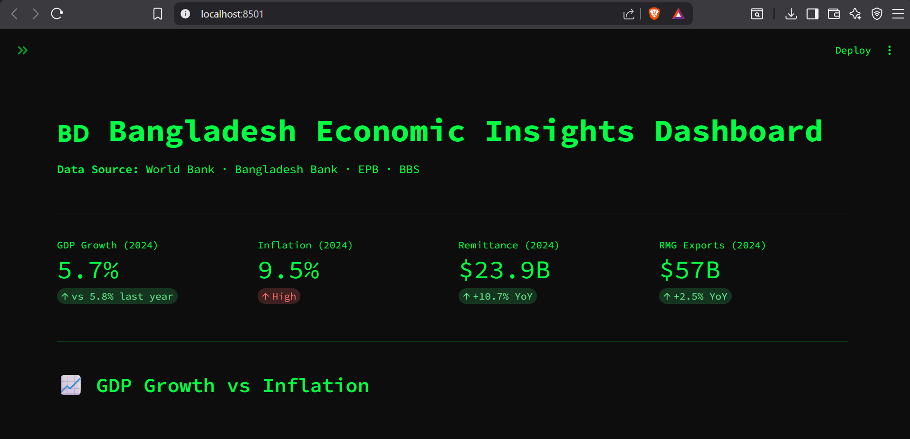
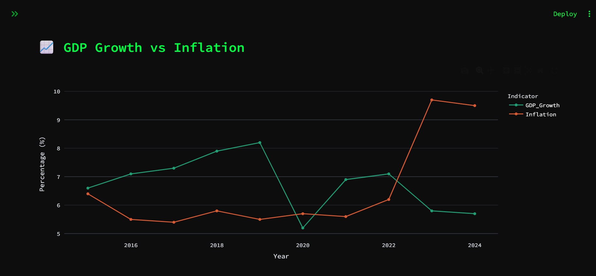
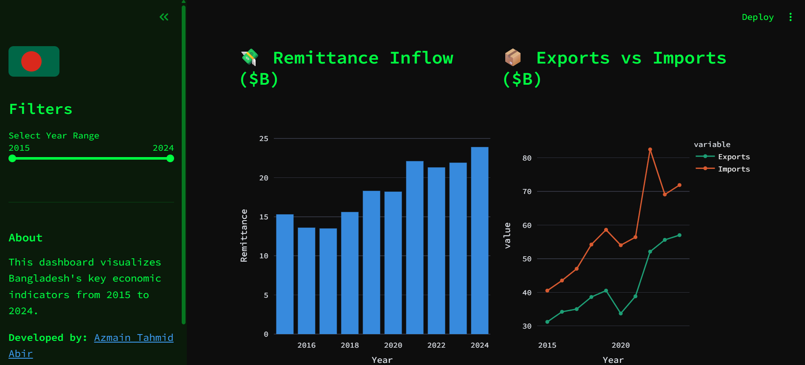

# 🇧🇩 Bangladesh Economic Insights Dashboard


> An interactive data science dashboard visualizing Bangladesh's key economic indicators from 2015 to 2024 — built with Python, Streamlit, and Plotly.

---

## 🔴 Live Demo

👉 **[View Live Dashboard](#)** ← _(update this link after deployment)_

---

## 📸 Screenshots





---

## ✨ Features

- 📊 **KPI Cards** — GDP Growth, Inflation, Remittance, RMG Exports at a glance
- 📈 **GDP vs Inflation** — Line chart comparing growth and inflation trends
- 💸 **Remittance Inflow** — Annual bar chart of remittance data
- 📦 **Exports vs Imports** — Trade balance visualization
- 🏦 **Foreign Reserves** — Color-coded bar chart showing reserve trends
- 🎯 **Poverty Rate** — Area chart showing poverty reduction over time
- 📅 **Year Range Filter** — Interactive sidebar slider to filter all charts
- 📋 **Raw Data Table** — Full dataset visible and explorable

---

## 🛠️ Tech Stack

| Tool           | Purpose                       |
| -------------- | ----------------------------- |
| Python 3.12    | Core programming language     |
| Streamlit      | Web dashboard framework       |
| Pandas         | Data loading and manipulation |
| Plotly Express | Interactive charts            |
| CSV            | Data storage                  |

---

## 📁 Project Structure

```
bangladesh-dashboard/
├── .streamlit/
│   └── config.toml        ← Theme configuration
├── data/
│   └── bangladesh_data.csv ← Economic dataset
├── assets/
│   ├── screenshot1.png    ← Dashboard overview
│   ├── screenshot2.png    ← Charts view
│   └── screenshot3.png    ← Sidebar view
├── notebooks/
│   └── eda.ipynb          ← Exploratory data analysis
├── app.py                 ← Main dashboard application
├── requirements.txt       ← Python dependencies
└── README.md              ← You are here
```

---

## 🚀 Getting Started

### 1. Clone the repository

```bash
git clone https://github.com/azmainabir/bangladesh-dashboard.git
cd bangladesh-dashboard
```

### 2. Install dependencies

```bash
pip install -r requirements.txt
```

### 3. Run the dashboard

```bash
streamlit run app.py
```

### 4. Open in browser

```
http://localhost:8501
```

---

## 📊 Data Sources

| Indicator         | Source                                |
| ----------------- | ------------------------------------- |
| GDP Growth        | World Bank                            |
| Inflation Rate    | World Bank                            |
| Remittance Inflow | Bangladesh Bank                       |
| Exports & Imports | Export Promotion Bureau (EPB)         |
| Foreign Reserves  | Bangladesh Bank                       |
| Poverty Rate      | Bangladesh Bureau of Statistics (BBS) |

---

## 📦 Requirements

```
streamlit
pandas
plotly
openpyxl
```

---

## 🗺️ Roadmap

- [x] KPI cards
- [x] Interactive charts
- [x] Year range filter
- [x] Raw data table
- [ ] Deploy to Streamlit Cloud
- [ ] Add more indicators (literacy rate, employment)
- [ ] Add Bangladesh map choropleth
- [ ] Compare with neighboring countries (India, Pakistan)
- [ ] Add data download button

---

## 📄 License

This project is licensed under the MIT License.

---

## 👨‍💻 Developer

**Azmain Tahmid Abir** — CSE Student @ Daffodil International University · Passionate about Data Science · AI Engineering · Cyber Security · Software Development.

[](https://www.linkedin.com/in/azmain-abir)
[](https://github.com/azmainabir)

---

_Built as part of a Data Science & Analytics portfolio project._
